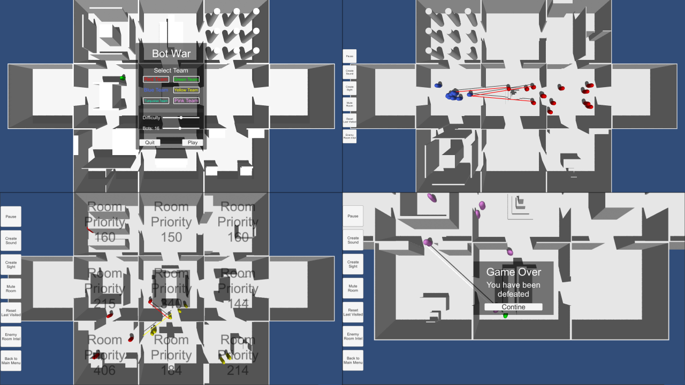

# Bot War

My entry to the 31:st Ludum Dare game jam (theme: Entire Game on One Screen), following the compo rules (alone, from scratch, 48 hours).

[Download the game here](https://github.com/Aggrathon/LudumDare31/releases) or [check out the Ludum Dare entry](http://ludumdare.com/compo/ludum-dare-31/?action=preview&uid=37874) (dead link)!

## Lore

Using humans for warfare is plain stupid, bots on the other hand... they have aimbots!

To minimize the potential for hacking the bots make their decisions all on their own, however they communicate through a server. Which gives you an angle of attack, change how the bots percieve the world!

## Gameplay

| Controls      |               |
|---------------|---------------|
| WASD, Scroll  | Adjust Camera |
| Space         | Pause         |
| E,R,T,F,G     | Abilities     |
| Mouse Click   | Select Bots / Target Abilities |
| Escape        | Back to Main Menu |

### Abilities

- Make Sound/Sight: Works as if a bot had seen/heard something in a room
- Mute Room: Removes half the priority gained from sights and sounds (Can be used twice)
- Reset Last Visited: Rooms that have recently been visited by a bot have lower priority (doesn't need to be searched)
- Enemy Room Intel: Show how the enemy bots MIGHT prioritize different rooms.

### Tips

- Use 'Pause', 'Click' and 'Enemy Intel' to get an idea of where the bots MIGHT be going
- The bots have a mind of their own therefor you cant force them to go somewhere (you can however make a room very tempting)

## Ludum Dare Tip

Don't make LD your first try at an unfamiliar complex AI system, you won't get much else done...

## Software Used

Unity, RAIN, Paint.NET, bfxr.net, autotracker.py

## Screenshots

